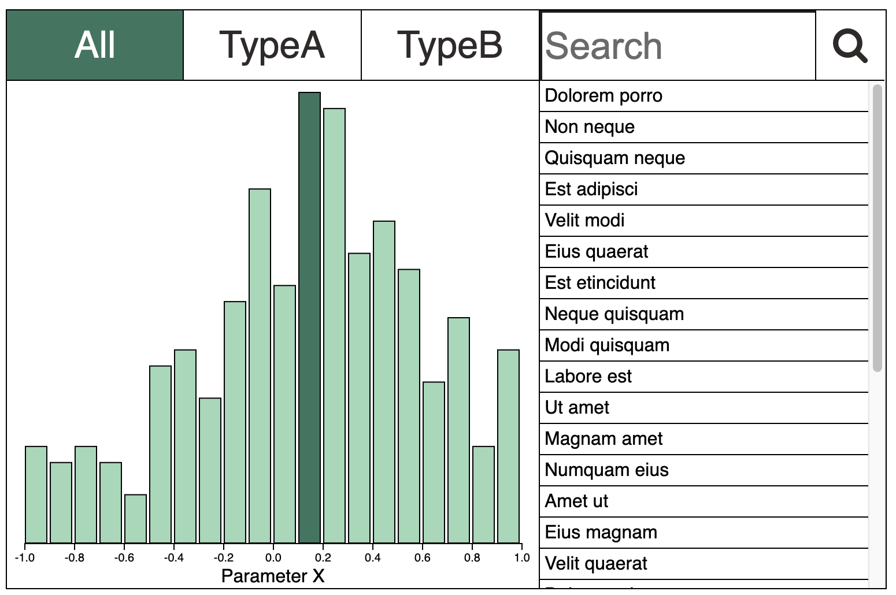

## Interactive Searchable Bar Chart

A live version is available [here](https://ageller.github.io/interactiveBarChart/).

* Clicking on the top row of buttons lets you select subsamples of the data.  (This is dummy data, and contains three "types" of elements -- A, B, C, dominated by A and B.) 
* Click on any bar to see the list of data elements in that bin.  
* Use the search box to search for any individual data element by name. (Names for each data element were generated from python's [lorem](https://pypi.org/project/lorem/) package.)  
* Within panel below the search bar you can click on any data element to see the "type" (e.g., A, B, or C). 

I also created a bl.ock of this, built with [blockbuilder.org](http://blockbuilder.org), [here](https://bl.ocks.org/ageller/8f947a4cf96d61f144a21ec0adfbea55/9e54e08f25cbfbe8fcd4d2177b2bc7de66a731d5)
